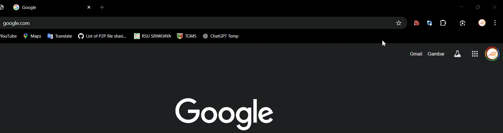

# Auto-Page Refresher

> Chrome extension to auto-refresh pages with advanced selector and condition options

Auto-Page Refresher is a Chrome extension that allows you to automatically reload web pages at a custom interval, with powerful options to check for element changes, compare selectors, and reload only specific URLs. Inspired by productivity tools and designed for modern workflows.

## Features

- Auto-refresh any page at a custom interval
- Add multiple CSS selectors to check before refreshing
- Optional: Compare two selectors with operators (==, !=, >, <, etc.) before reload
- Optional: Only reload if a specific URL is open
- Debug tool to check selector/value on the current page
- Clean, modern, and user-friendly interface

## Installation
1. Download the latest release from [GitHub](https://github.com/akbarhlubis/refersh-page-extension/releases) or clone this repository
2. Open Chrome and navigate to `chrome://extensions/`
3. Enable "Developer mode" in the top right
4. Click "Load unpacked" and select the extension directory
5. Auto-Page Refresher extension should now be installed

## Usage

1. Click on the extension icon to open the popup
2. Add one or more CSS selectors to monitor (optional)
3. (Optional) Enable and configure compare selectors for advanced conditions
4. (Optional) Enable reload for a specific URL only
5. Set the refresh interval (in milliseconds)
6. Click "Turn ON Reload" to start auto-refreshing
7. Use the debug tool to check selector/value on the current page

## License

MIT